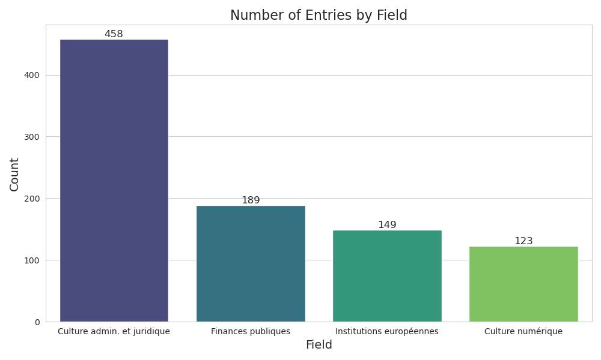
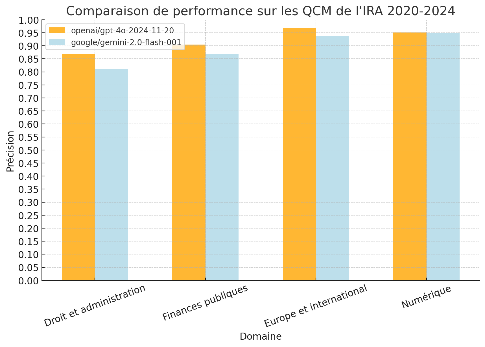

## Introduction :

Standard benchmarks for large language models (LLMs) usually focus on scientific domains, with much less testing in Humanities and Law which are crucial for administrative work. This project tries to fill that gap by evaluating LLMs using 919 multiple-choice questions (MCQs) from the French Regional Administration Institutes (IRA) competitions (2020–2024). These questions cover key areas: public law, public finance, European/international relations, and digital culture. In light of France’s digital transition, this dataset can both test and fine-tune LLMs and support their integration into the administration.

## Methodology :

1. Pre-processing:
- Data origin: Open-access PDFs of IRA MCQs ([Annales des QCMs](https://www.fonction-publique.gouv.fr/devenir-agent-public/les-meilleures-copies-et-corriges)).
- Extraction: Since correct answers are highlighted (but not text-encoded), a VLM was used to structure the data into JSON. This step employed pdf2image for conversion and ell for VLM API calls, with a few-shot prompt approach.
- Formatting: The structured data was saved as an Apache Parquet dataset using polars. Manual and automatic checks ensured answers consistency and up-to-date information (e.g., verifying spelling for questions like “Who is the Secretary General of the Élysée?”).

2. Benchmarking:
- API & Models: Questions were sent via ell to the OpenRouter API, allowing access to multiple models.
- Permutations: 5,414 answer order permutations were generated to control for order effects, and, the results showed the same effect, choosing more the 1st and 3rd options.
- Analysis: A CSV of raw results was processed with polars to extract final metrics.

## Conclusions :

Testing two models (due to cost constraints) showed similar overall accuracy. However, performance varied by field—better on international and digital questions than on administrative and legal ones. Future benchmarks should :
- Expand the dataset with MCQs from additional competitions.
- Include more models (e.g., models like Mistral with extensive French training data).
- Improve answer extraction methods to reduce OCR-related errors.
- Ensure absence of data contamination.
